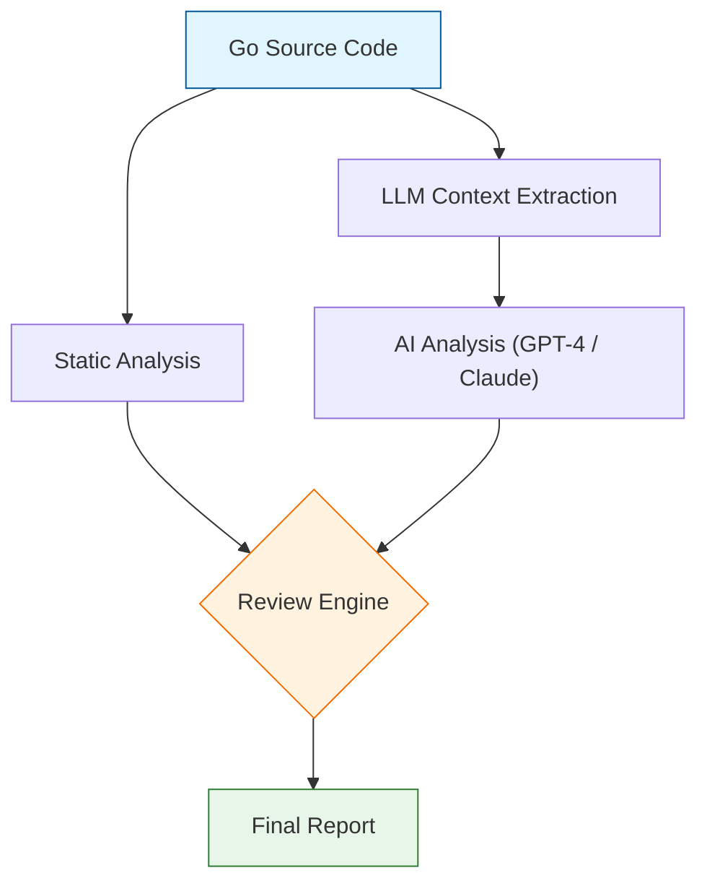

# GoReview

> AI-Powered Go Code Review Assistant - Combining static analysis 
  with LLM insights to catch bugs, security issues, and code quality problems.

[](https://goreportcard.com/report/github.com/rajanmehta/ai-go-code-review)
[](https://opensource.org/licenses/MIT)

## ✨ Features

- **Static Analysis** - Comprehensive Go code linting and analysis
- **AI-Powered Review** - Leverages GPT-4 and Claude for intelligent insights
- **Quality Scoring** - 6-dimensional quality assessment framework
- **Flexible Output** - Multiple format options (JSON, terminal, HTML)

## 🚀 Quick Start

### Installation
```bash
go install github.com/rajanmehta/ai-go-code-review@latest
```

### Build from Source
```bash
git clone https://github.com/rajanmehta/ai-go-code-review.git
cd ai-go-code-review
go build -o goreview
```

### Usage
```bash
# Review a Go file
./goreview review myfile.go

# Review entire directory
./goreview review ./src

# Export results as JSON
./goreview review ./src --format json > results.json
```

## 📊 Example Output

```
✓ main.go: Quality Score 8.5/10
├─ Issues Found: 2
│  ├─ warn: Unused import "fmt"
│  └─ error: Potential race condition on line 42
├─ Coverage: 78%
└─ Security: High
```

## 🏗️ How It Works

GoReview combines multiple analysis techniques:



## 💡 Use Cases

| Use Case | Benefit |
|----------|---------|
| **AI-Generated Code** | Validate code produced by ChatGPT, Claude, or other AI models |
| **Pre-commit Hooks** | Catch issues before they reach your repository |
| **CI/CD Integration** | Automated reviews in GitHub Actions, GitLab CI, or Jenkins |
| **Code Learning** | Understand Go best practices through detailed feedback |
| **Code Audits** | Quick assessment of large codebases |

## 🔧 Configuration

### Local Models (Ollama)
GoReview uses **Ollama** by default. Ensure Ollama is installed and running.

To change the model:
```bash
export OLLAMA_MODEL="llama3"
# or
export OLLAMA_MODEL="mistral"
```

### Cloud Models (Optional)
To use OpenAI or Anthropic, set the API key (support to be re-enabled via flags):

```bash
export OPENAI_API_KEY="your-api-key"
```

## 📦 API Configuration

Set environment variables for LLM access:

```bash
export OPENAI_API_KEY="your-api-key"
# OR
export ANTHROPIC_API_KEY="your-api-key"
```

## 📄 License

MIT License - see LICENSE file for details

## 🤝 Contributing

Contributions are welcome! Please feel free to submit a Pull Request.
